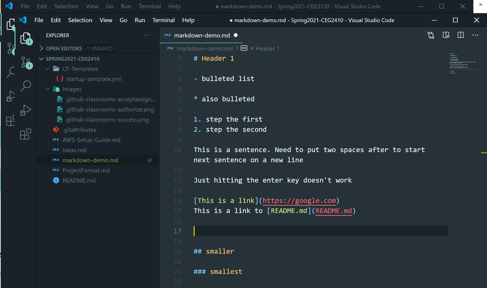

# Project 2

- [Project Description](#Project-Description)
- [Template for project](#Template-for-Project)
- [Submission](#Submission)
- [Rubric](#Rubric)

## Objectives

- fidget with different container platforms
- use container registries to pull down container images

## Project Description

You are going to pick two container technologies and compare how they work.  It is very common to see build instructions for a container that involve two different container technologies.  So you are going to do the same.  See class slides for the favored names to pick from.

I recommend, but do not require, that you do this project in a VM that has a Linux based host OS.  Windows, even with WSL2, can be a bit confusing to navigate for first timers trying to understand what is happening.  

**Docker Desktop is not allowed for the purposes of this project.**

Your deliverable for this project is once more documentation.  You can use the below as a template of what your documentation needs.

This will look really slick if you start using markdown.  For example:  
`$ something I want to look command liney`

```
some sample
output text
could go in this
```
Store screenshots in a folder in your repo, then refence them:
``



# Template for project

## Container Technologies
- Container platform 1
- Container platform 2

## How to install
- installation instructions (likely command line instructions) for installing each on your system (your VM, if you follow my advice)

## Pulling a container image
- Pick a base image to tinker with.  Write instructions for pulling each with each
- How to view container images on the system

## Running a container
- Define the modes below and why you would want to pick each
- Initializing versus running the container, and why there is a difference
- Run and enter shell
- ~~Run in sandbox mode~~ removed 10/3
- Run in detached mode

## Logs & Status
- Finding out the status of the container
- Reading the logs of a running container

## Stopping a container
- Pause
- Restart / resume
- Stop / kill

# Submission

1. Commit and push your changes to your repository.  Verify that these changes show in your course repository, https://github.com/WSU-kduncan/cs2900-YOURGITHUBNAME

2. In Pilot, paste the link to your project folder.  Sample link: https://github.com/WSU-kduncan/cs2900-YOURGITHUBUSERNAME/blob/main/Projects/Project2

# Rubric
[Rubric](Rubric.md)