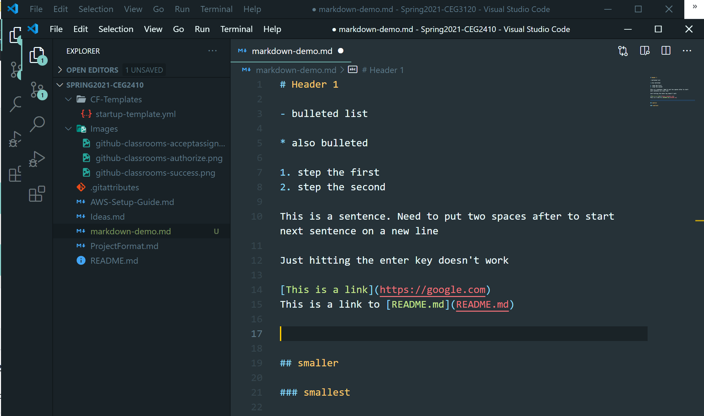

# Project 3

- [Project Setup](#Project-Setup)
- [Project Description](#Project-Description)
- [Template for project](#Template-for-Project)
- [Submission](#Submission)
- [Rubric](#Rubric)

## Objectives

- for two different container engines:
  - investigate types of mounts
  - investigate building container images

## Project Setup

In Project 2, you choose some container technologies and explored the basics of how they worked. Peek at your project feedback and make sure your selected engines will be up for the task and change over as necessary.

I recommend, but do not require, that you do this project in a VM that has a Linux based host OS. Windows, even with WSL2, can be a bit confusing to navigate for first timers trying to understand what is happening.

**Docker Desktop is not allowed for the purposes of this project.**

Your deliverable for this project is once more documentation. You can use the below as a template of what your documentation needs.

This will look really slick if you start using markdown. For example:  
`$ something I want to look command liney`

```
some sample
output text
could go in this
```

Store screenshots in a folder in your repo, then refence them:
``



## Project Description

1. Investigate available mounts.
   - For Docker, for example, there exist two mount types, volumes and bind mounts.
   - For the two engines of your choice (of which Docker can be one choice) state:
     - the mount type(s) available
     - how to use the mount type(s) for the container
2. Investigate building images for the container engine
   - For Docker, for example, images are built from Dockerfiles
     - Some container engines, as noted in class, do not support building images - therefore you will need to install an image builder and then have the container engine run the built image
   - For the two container engines of your choice (of which Docker can be one choice) state:
     - If there are image build tools provided and how to:
       - build an image (the command)
       - how to write a build file
         - Think psudeo-code style - I don't need a working project, I need a quick lookup of what goes in the file (FROM, RUN, COPY, etc.)
     - If the engine does not include build tools, how to install and use an image builder (like Buildah)
       - how to install
       - how to build an image
       - how to write a build file
         - Think psudeo-code style - I don't need a working project, I need a quick lookup of what goes in the file (FROM, RUN, COPY, etc.)

## Submission

1. Commit and push your changes to your repository. Verify that these changes show in your course repository, https://github.com/WSU-kduncan/cs2900-YOURGITHUBNAME

2. In Pilot, paste the link to your project folder. Sample link: https://github.com/WSU-kduncan/cs2900-YOURGITHUBUSERNAME/blob/main/Projects/Project3

## Rubric

[Rubric](Rubric.md)
